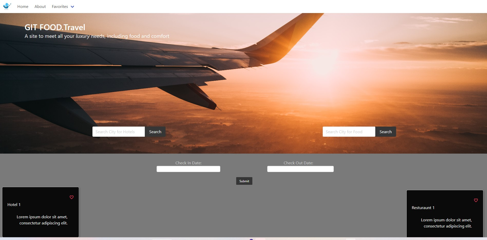

# GIT FOOD.Travel
## Description
----------------------------------
A Webpage that will provide key travel information

- As a frequent traveler
- its is very nice to know the hotels available and resturaunts in a specific area for future travel shenanigans!

## Usage
----------------------------------
-       to search for hotels, enter a check-in and check-out date as well as a city name in the search bar for hotels, this will bring up the top 5 hotels with a 4 star rating or higher, and it will be displayed on the left column of cards below!

-       to search for resturaunts, enter a city name in the resturaunts search bar and it will retrieve the top 5 resturaunts which will be displayed on the right column of cards below!

---------
# Credits
---------

## Devs

- Nigel Poblete
- 
-

## Tools Used

- Html
- Css
- JavaScript
- Bulma
- Font Awesome

## API'S Used

If you used any third-party assets that require attribution, list the creators with links to their primary web presence in this section.

----------

## License
N/A

